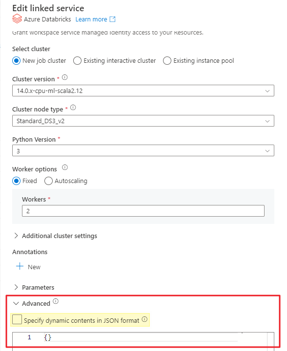
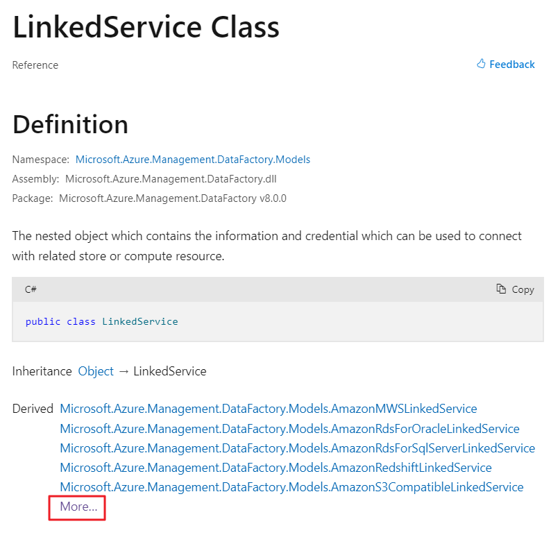
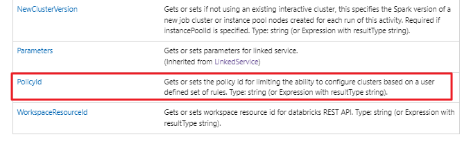
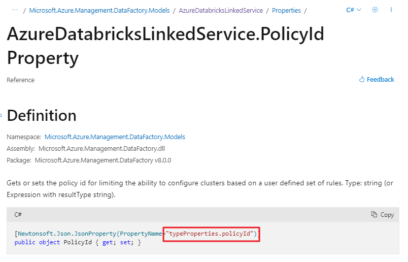
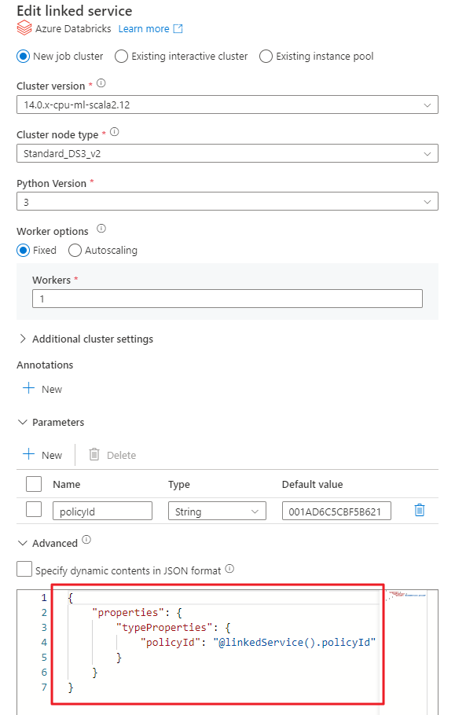
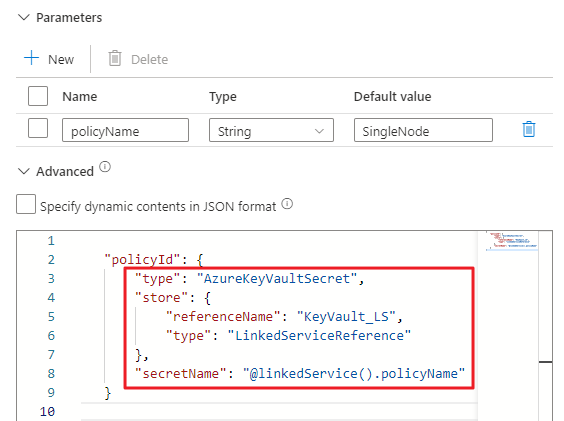

Ever wished you could add dynamic content, parameterize, or reference a Key Vault secret value for Linked Service properties that only accept static inputs in the Azure Data Factory or Azure Synapse UI? In this post, I'll introduce you to a feature that's often overlooked, but incredibly handy for these purposes.

# Use Case #1: Dynamically Apply a Databricks Cluster Policy

In this scenario, we have a Databricks Notebook activity. Our goal is to dynamically specify a Databricks Cluster Policy. Instead of directly providing a Policy GUID as an input, we aim to reference a GUID stored in a key vault. 

Some practical applications of this include:
- Switching between SingleNode and MultiNode job clusters dynamically.
- Using pipeline metadata to determine the job cluster size.
- Applying a cluster attribute through a policy, especially if it's not supported via the Databricks linked service.

## Specifying Advanced Properties

Both ADF and Azure Synapse UIs offer the _Advanced_ dropdown within the Linked Service configuration pane, enabling you to specify additional properties.

Choose **Specify dynamic contents in JSON format**, and you can insert dynamic content like expressions or even reference Azure Key Vault secrets.



When you enable this feature for a Linked Service, it enhances the connection's attributes and dynamic content beyond the GUI's capabilities.

> ⚠️ **IMPORTANT:** Once you introduce dynamic content to the advanced section, such as _@linkedService().policyId_, the Linked Service GUI will no longer display any properties. All subsequent edits must then be done through JSON.

### Adding Properties Not Available in the GUI

Our current use case involves setting the PolicyId property. However, this property is conspicuously absent in the GUI options.

For further insight, refer to this informative [Microsoft blog post](https://techcommunity.microsoft.com/t5/azure-synapse-analytics-blog/how-to-advanced-properties-of-linked-services/ba-p/3627033). It details how to discover properties that extend beyond the GUI. In summary, the [Azure SDK for .NET](https://learn.microsoft.com/en-us/dotnet/api/microsoft.azure.management.datafactory.models.linkedservice?view=azure-dotnet) documentation reveals the derived linked service classes for each connection type.

Here's how we can figure out the JSON synax for one of these unexposed properties:

1. Go the the [Azure SDK for .NET](https://learn.microsoft.com/en-us/dotnet/api/microsoft.azure.management.datafactory.models.linkedservice?view=azure-dotnet) documentation
1. Click the **More...** section to unveil all Linked Service classes

    

1. Upon exploring the AzureDatabricksLinkedService class, you'll encounter a table labeled _Properties_. These properties can be specified in JSON, even if not listed in the GUI.

    Interestingly, towards the table's end, you'll spot the elusive PolicyId property, missing from the GUI.
    

1. Drilling into the desired Property reveals the path necessary for creating a valid JSON data structure.

    

1. This informs us that the Linked Service properties' path is **typeProperties.policyId**, represented in the following JSON:

```json
{
    "properties": {
        "typeProperties": {
            "policyId": "@linkedService().policyId"
        }
    }
}
```
Incorporate this JSON into the Linked Service Advanced section to expand the GUI's capabilities.



Voilà! We've successfully parameterized the cluster policy used when creating a job cluster through this Linked Service.

### Invoking Key Vault Secrets Beyond the GUI
Parameterizing the Linked Service is done, but we're still stuck with a GUI input – not the ideal user experience. While I might recall a policy's name, its GUID isn't as memorable.

Let's revise our input parameter, switching from policyId to policyName. The syntax below indicates that the Key Vault should retrieve a value through a secret:

```json
"policyId": {
    "type": "AzureKeyVaultSecret",
    "store": {
        "referenceName": "KeyVault_LS",
        "type": "LinkedServiceReference"
    },
    "secretName": "@linkedService().policyName"
}
```

In this scenario, the secret's name in the Azure Key Vault should match the policy's name. For flexibility, you could append or prepend names and employ the same logic in an expression that defines the secretName.



Finally, our Key Vault can house both environment-specific and policy-specific GUIDs. In our pipelines, referencing policies by name allows the associated policy to be invoked dynamically based on various conditions.

There you have it, things you never knew you could do via Linked Services. Enjoy!