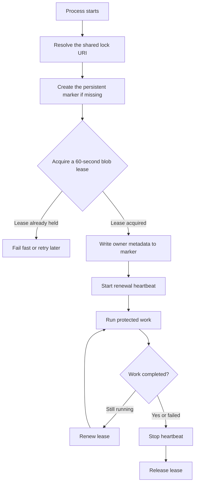

Leased a blob? No, this isn't some new car model with a great leasing offer. Blobs are files in ADLS / OneLake, and leasing is the process of temporarily holding an exclusive lock on one of those files. Does this sound useful in data engineering? Maybe not at first, but in this post I'll show why understanding the extended features of object storage APIs like blob leases can be invaluable when building data systems that scale.

# Job-level concurrency control

How does an engineer ensure singleton, non-duplicative runs of a given process? Sure, we can build our Spark pipelines to be idempotent, but how can we prevent duplicate runs spanning Pipelines, Notebooks, Spark Job Definitions, APIs, and any other place you might execute the same data engineering process?

First, let's level set on where platform capabilities stand:

1. **Notebooks:** Directly scheduled, triggered, or interactively run Notebooks have no means of guaranteeing fixed concurrency. Multiple users could trigger the same Notebook, or it could be triggered interactively while it is already running on a schedule, from a Pipeline, through an API, etc.
1. **Spark Job Definitions:** Same as Notebooks, there is no setting that blocks all of the different ways the job can be triggered from overlapping.
1. **Pipelines:** Pipeline settings enable you to set a maximum concurrency. You could set this to `1` and block overlapping runs of the same Pipeline, but this doesn't stop another developer from dropping the same Notebook or Spark Job Definition into another Pipeline, scheduling it directly, or running the underlying Spark code interactively.


Is this a challenge unique to Fabric? No. Databricks has the same core surface area for managing or limiting concurrency at the orchestration level: Jobs. Orchestrators can generally control themselves, but they don't inherently know that some other orchestrator, API, Notebook, or application is executing the same logical process.

So, let's say that you have an expensive, long-running job that must be non-duplicative because overlapping runs could generate duplicate downstream data or compete when committing data and cause concurrent-writer conflicts. What do you do? Be uber careful about not clicking **Run** twice, coordinate across the team whenever a manual maintenance job is run, and be ultra careful about not deploying the same job in multiple Pipelines? Sure, do all of those things, but we as data engineers can get more creative and guarantee specific outcomes rather than relying on developers being more than human. This is where job locks come into play.

> **This is not required for every data pipeline.** Most pipelines should continue relying on idempotent processing, transactional writes, and the concurrency controls already available in their orchestrator. A job lock earns its complexity when the same logical process can be launched from multiple execution surfaces and overlapping runs would be expensive, unsafe, or duplicative.

## Job locks

A job lock can solve this. We need to create a globally available signal that tells every possible runner whether a named process is already active and gives exactly one runner the exclusive right to do the work. Back in my SQL Server days, I remember using [`sp_getapplock`](https://learn.microsoft.com/en-us/sql/relational-databases/system-stored-procedures/sp-getapplock-transact-sql?view=sql-server-ver17) to accomplish something similar, but how do we do this in the lakehouse era?

As a first attempt, you might consider writing a file to OneLake or ADLS at the start of your job to signal that it is active. Any duplicate run would see the file and raise an exception because it couldn't acquire the lock. Great, but this leaves plenty of gaps:

- _How do you atomically prevent two processes from taking the lock at the same time?_
- _How do you renew the lock while a long-running process is still healthy?_
- _How do you ensure that a lock doesn't get permanently held?_ Relying on deleting the file after successful processing could result in a permanent lock if the job fails in the middle.

While there are some unnecessarily complex ways that you could build this with standard storage operations, the [Lease Blob API](https://learn.microsoft.com/en-us/rest/api/storageservices/lease-blob) comes to the rescue. A blob lease is storage-managed concurrency control. One client acquires the lease, receives a lease ID, and remains the owner until it releases the lease or allows a finite lease to expire. A competing client cannot acquire another lease on the same blob while that lease is active.

The process flow looks like this:



> **The marker is persistent; the lease is temporary.** Deleting and recreating the lock file on every run introduces another race that we don't need. If the process is killed before it can clean up, renewal stops and the finite lease eventually becomes available without requiring a human to break it.

### The basic building blocks

I am going to use `fsspec` because Fabric already uses an Azure-backed filesystem implementation for `abfss://` paths. That filesystem has already resolved the OneLake endpoint and authentication, but it also exposes the underlying Azure Storage service client. This gives us a convenient high-level API for working with the file and a lower-level API for acquiring its lease.

Start with a URI that represents the logical process, not a particular run:

```python
lock_uri = (
    "abfss://<workspace-id>@onelake.dfs.fabric.microsoft.com/
    "<lakehouse-id>/Files/locks/customer-360-refresh.lock"
)
```

> **The name is the contract.** Every Pipeline, Notebook, Spark Job Definition, API, or application that performs the `customer-360-refresh` process must use this same URI. Do not include a run ID, timestamp, Notebook name, or Pipeline name; doing so would create a different lock for every caller and defeat the entire point.

#### 1. Resolve the filesystem and marker path

```python
import fsspec

fs, path = fsspec.core.url_to_fs(lock_uri)
```

`url_to_fs` gives us the configured filesystem and the filesystem-relative path. In Fabric, this also means we can reuse the identity that resolved the `abfss://` URI rather than separately building an Azure credential flow just to manage the lock.

#### 2. Create the persistent marker

```python
try:
    fs.pipe_file(path, b"{}", overwrite=False)
except Exception as exc:
    if exc.__class__.__name__ not in {"FileExistsError", "ResourceExistsError"}:
        raise
```

The write uses `overwrite=False`, so concurrent callers cannot silently replace the marker. One process creates it; every later process sees that it already exists and continues. I am checking the exception name because the exact "already exists" exception can vary with the installed filesystem and Azure SDK versions. Everything else is re-raised because an authorization failure, invalid URI, or network problem is not the same thing as a healthy pre-existing lock file.

#### 3. Get the underlying blob client

```python
container, blob, _ = fs.split_path(path)

blob_client = fs.service_client.get_blob_client(
    container=container,
    blob=blob,
)
```

This is the useful bridge between `fsspec` and the Azure Storage SDK. We use `fsspec` to resolve and manage the path, then use its authenticated service client to reach the lease API that normal file operations don't expose.

#### 4. Acquire the lease and identify the owner

The Azure filesystem client is asynchronous, so `fsspec.asyn.sync` lets normal synchronous job code call it safely:

```python
import json
from datetime import datetime, timezone

import notebookutils
from fsspec.asyn import sync

lease = sync(
    fs.loop,
    blob_client.acquire_lease,
    lease_duration=60,
)

context = notebookutils.runtime.context
marker = {
    "currentNotebookName": context["currentNotebookName"],
    "currentWorkSpaceName": context["currentWorkSpaceName"],
    "isForPipeline": context["isForPipeline"],
    "isForInteractive": context["isForInteractive"],
    "userName": context["userName"],
    "acquired_at": datetime.now(timezone.utc).isoformat(),
}

sync(
    fs.loop,
    blob_client.upload_blob,
    json.dumps(marker).encode(),
    overwrite=True,
    lease=lease,
)

sync(fs.loop, lease.renew)
```

A finite blob lease can be between 15 and 60 seconds. Here, the first call gives this process the exclusive 60-second lease. Only after acquiring it do we overwrite the marker, passing the lease so no other process can change the owner metadata. The JSON records which Notebook, workspace, execution mode, and user acquired the lock along with a UTC timestamp. The final call resets the 60-second countdown. In a real job, renewal must run on a heartbeat while the protected work is executing. If another process tries to acquire the lease before it expires, Azure Storage rejects the request atomically. There is no small window where both runners can believe they own the lock.

> **The lease state is the source of truth.** The marker remains after release, so reading its JSON tells you who most recently acquired the lock; it does not by itself prove that the lock is still active.

#### 5. Release the lease

```python
sync(fs.loop, lease.release)
```

Release should happen in a `finally` block so success and failure both make the lock immediately available. If the process is abruptly terminated and never reaches the `finally` block, the finite lease expires after renewal stops. This is precisely why I prefer a renewable finite lease over an infinite one: process death becomes automatic lock cleanup rather than a permanent operational incident.

## The lock is also operational metadata

There is a nice side benefit to writing the execution context into the marker: blob leases prevent competing writes, but they don't prevent reads. Anytime a process is locked, an engineer can instantly see who acquired it, where it is running, and whether it came from an interactive or Pipeline execution:

```python
lock_status = spark.read.json(lock_uri)
display(lock_status)
```

The resulting DataFrame would look something like this:

| acquired_at | currentNotebookName | currentWorkspaceName | isForInteractive | isForPipeline | userName |
| --- | --- | --- | --- | --- | --- |
| 2026-08-05T23:42:17.481920+00:00 | Customer 360 Refresh | Production Data Engineering | false | true | Miles Cole |

> **This turns the lock into a tiny operational dashboard.** When a second run fails to acquire the lease, you don't just know that _something_ has the lock. You can immediately read the marker with `spark.read.json(lock_uri)` and identify the Notebook, workspace, execution type, user, and acquisition time responsible for the active run.

## Packaging the pattern

The individual operations are pretty simple, but I don't want lease acquisition, renewal, and cleanup copy-pasted into every Notebook. The useful version is one small context-manager function so callers only need to agree on the lock name.

Put the following into a module such as `job_locks/blob_lease.py`, package it into your shared Python wheel or add it to the Notebook/Environment resources, and add `fsspec` and the Azure filesystem implementation used by your environment as dependencies:

```python
import json
import threading
from contextlib import contextmanager
from datetime import datetime, timezone

import fsspec
import notebookutils
from fsspec.asyn import sync


@contextmanager
def job_lock(lock_uri: str):
    fs, path = fsspec.core.url_to_fs(lock_uri)

    try:
        fs.pipe_file(path, b"{}", overwrite=False)
    except Exception as exc:
        if exc.__class__.__name__ not in {"FileExistsError", "ResourceExistsError"}:
            raise

    container, blob, _ = fs.split_path(path)
    blob_client = fs.service_client.get_blob_client(container=container, blob=blob)

    try:
        lease = sync(fs.loop, blob_client.acquire_lease, lease_duration=60)
    except Exception as exc:
        if getattr(exc, "error_code", None) == "LeaseAlreadyPresent":
            raise RuntimeError(f"Job lock is already held: {lock_uri}") from exc
        raise

    context = notebookutils.runtime.context
    marker = {
        "currentNotebookName": context["currentNotebookName"],
        "currentWorkspaceName": context["currentWorkspaceName"],
        "isForPipeline": context["isForPipeline"],
        "isForInteractive": context["isForInteractive"],
        "userName": context["userName"],
        "acquired_at": datetime.now(timezone.utc).isoformat(),
    }
    sync(
        fs.loop,
        blob_client.upload_blob,
        json.dumps(marker).encode(),
        overwrite=True,
        lease=lease,
    )

    stop = threading.Event()
    renewal_error = []

    def renew():
        while not stop.wait(30):
            try:
                sync(fs.loop, lease.renew)
            except Exception as exc:
                renewal_error.append(exc)
                stop.set()
                return

    thread = threading.Thread(target=renew, daemon=True)
    thread.start()

    try:
        yield
        if renewal_error:
            raise RuntimeError(f"Lease renewal failed: {lock_uri}") from renewal_error[0]
    finally:
        stop.set()
        thread.join()
        try:
            sync(fs.loop, lease.release)
        except Exception:
            if not renewal_error:
                raise
```

Now the entry point in a Notebook, Spark Job Definition, or plain Python application becomes intentionally boring:

```python
from job_locks.blob_lease import job_lock

lock_name = "customer-360-refresh"
lock_uri = (
    "abfss://<workspace-id>@onelake.dfs.fabric.microsoft.com/"
    f"<lakehouse-id>/Files/locks/{lock_name}.lock"
)

with job_lock(lock_uri):
    build_bronze_tables()
    build_silver_tables()
    publish_customer_360()
```

The context manager acquires the lease, writes the Fabric execution context and acquisition time into the marker, renews the lease every 30 seconds, releases it on success or failure, and raises a clear error when another runner already owns it. That is the complete interface: `with job_lock(lock_uri):`.

> **Only the renewal heartbeat runs in the daemon thread.** The job itself continues to run normally in the calling thread inside the `with job_lock(lock_uri):` block.

What the caller does when the lock is unavailable is a business decision. A manually triggered maintenance job might fail fast with a clear message. A scheduled process might retry with exponential backoff. A queue consumer might abandon the message so another worker can pick it up later. The lock primitive should report the truth; the orchestrator should decide how to react.

## The lock name is the global coordination layer

The most valuable part of this design is not really the blob or even the lease. It is the globally shared name.

Pipeline concurrency settings only coordinate runs of one Pipeline. Notebook scheduling settings only know about one Notebook. A Spark Job Definition only knows about its own executions. A blob lease doesn't care where the request came from. If five different execution surfaces resolve the same lock URI, Azure Storage arbitrates among all five and exactly one acquires it.

That makes the pattern applicable to any process that can agree on a stable lock name:

- `locks/customer-360-refresh.lock`
- `locks/daily-finance-close.lock`
- `locks/publish-eod-snapshot-to-portal.lock`
- `locks/extract-from-source-abc.lock`

The process can move from a Notebook to a Spark Job Definition without changing the lock. Two teams can use different orchestration tools and still coordinate. A support engineer can manually run a recovery script in production and participate in the same locking protocol. The protected code doesn't even have to be Spark code. It only needs access to the shared storage namespace, permission to lease the marker, and the discipline to use the same lock name before doing the protected work.

> **This is cooperative locking.** The blob lease protects the lock blob itself; it cannot magically stop code that ignores the protocol from modifying your tables. Every entry point that performs the protected logical process must acquire the same named lock. That is why packaging this as a common library matters. It turns a clever storage trick into a repeatable engineering standard.

# Final thought

Idempotency is still important. Transactional Delta operations are still important. Orchestrator-level concurrency limits are still useful. A job lock is not a replacement for any of those things; it reduces the risk associated with data engineers being humans and platforms not providing the concurrency guarantees we might need.

When the same logical process can be launched from multiple Pipelines, Notebooks, Spark Job Definitions, APIs, regions, or applications, the concurrency boundary should not live inside any one of those execution surfaces. Put the boundary somewhere they can all see, give the process a stable name, and let the storage service decide who gets the lease.

Sometimes the difference between _"we asked everyone not to run it twice"_ and an actual guarantee is just one tiny blob with a very important lease.
