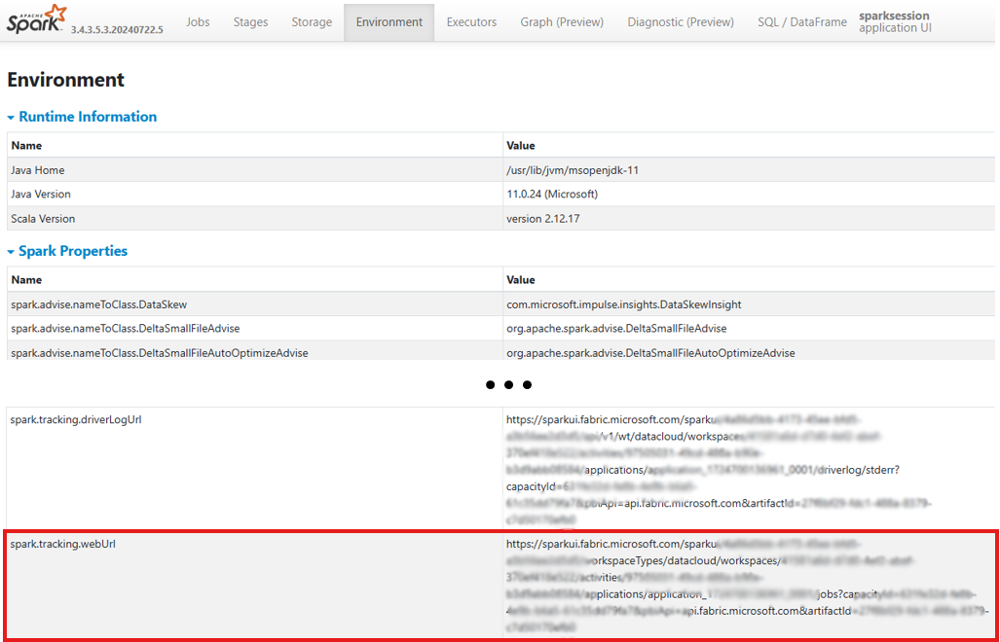

As data practitioners look to scale their data operations, there's a key pattern that many see as the holy-grail of massively scalable data engineering: metadata-driven orchestration and engineering. With this pattern comes the necessity to have extremely robust user defined logging and telemetry. In addition to key metrics such as processing duration and the logging of any exceptions, it is extremly helpful to log a link to the activity that was executed so that users can quickly navigate to the detailed run information at a moments notice.

When executing Fabric Spark Notebooks or Spark Job Definitions (SDJs), how exactly can we programmatically retrieve the URL to the Spark UI so that we can log this URL in our telemetry store?

If you look in the Spark UI _Environment_ tab, there's a Spark configuration labled as `spark.tracking.webUrl`.



To get spark configuration propertieis we'd typically run the below command:
```python
sparkui_url = spark.conf.get("spark.tracking.webUrl")
```
However this actually fails with the following error: **Py4JJavaError: An error occurred while calling o330.get.: java.util.NoSuchElementException: spark.tracking.webUrl**. This indicates that the property either doesn't exist or is not exposed via the Spark Config API.

Since we know the property exists from the Spark UI _Environment_ tab, we can access it via the protected `spark.sparkContext._conf.getAll()` method as this retrieves all settings currently set in the current Spark context. Since an array of settings is return, to make the results easier to reference, we'll conver the array to a dictionary.

```python
spark_configs = dict(spark.sparkContext._conf.getAll())
```

We can then python dictionary comprehension to get the value for the desired property:

```python
sparkui_url = spark_configs['spark.tracking.webUrl']
```
This now successfully returns the full URL to the Spark UI so that we can log it in our telemetry store.

While this approach allows to retrieve any Spark property by the name that is visible in the Spark UI, this specific property can also be directly retrieved as a variable of the spark context:

```python
sparkui_url = spark.sparkContext.uiWebUrl
```


https://app.powerbi.com/workloads/de-ds/sparkmonitor/27f8bf29-fdc1-488a-8379-c7d50170efb0/9b0faa49-9a50-4dbc-b053-c734ca5b2851?experience=data-engineering

https://sparkui.fabric.microsoft.com/sparkui/4a86d5bb-4173-45ee-bfd5-a3b56ee2d3d5/workspaceTypes/datacloud/workspaces/41581a6d-d7d0-4ef2-abef-370ef418e522/activities/9b0faa49-9a50-4dbc-b053-c734ca5b2851/applications/application_1724703097587_0001/jobs?capacityId=631fe32d-fe8b-4e9b-b6a5-61c35dd79fa7&pbiApi=api.fabric.microsoft.com&artifactId=27f8bf29-fdc1-488a-8379-c7d50170efb0