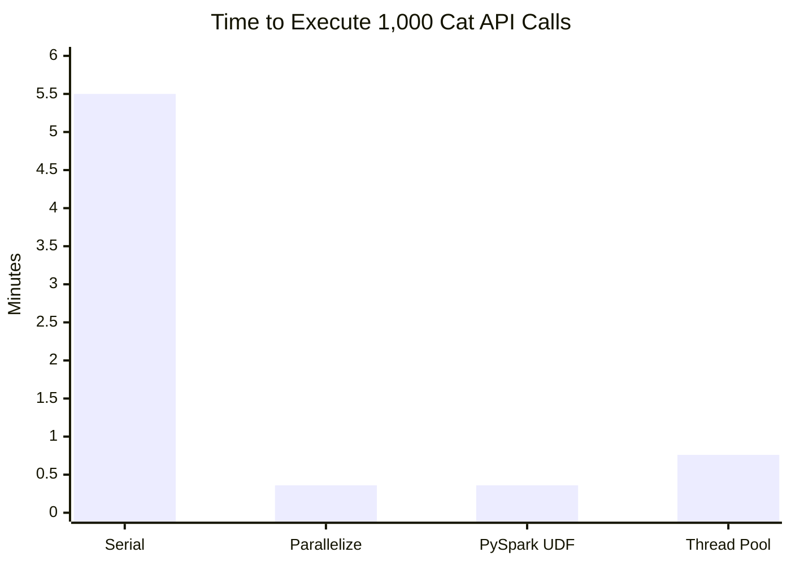

Spark is fantastic for distributed computing, but can it help with tasks that are not distributed by nature? Reading from a Delta table or similar is simple—Spark's APIs natively parallelize these types of tasks. But what about user-defined tasks that aren't inherently distributed?

In this post, I'll show how you can take advantage of the distributed nature of Spark for tasks that aren't natively handled by Spark.

# Parallelizing Any Operation
Imagine you have a Python operation that takes too long to run simply because it's executed serially across a large volume of tasks. A common example is making API calls. For instance, maybe you're starting with a large array of IDs, and you need to make an API call for each ID, collect the responses, and save them in a Delta table.

Before we dig into different ways to distribute such a task, let's frame up the example use case: cats! Honestly, I'm not a fan of cats, however my children love them and coincidentally there's a pretty neat API called _TheCatAPI_. Yes, an API for cats—well, not _for_ cats, since cats can't code—but the API returns information about cats. Fun!

My goal is to see how quickly I can make 1,000 API calls to _TheCatAPI_, then parse and save the JSON responses with completely useless information about cats to OneLake for further cat analysis.

> Note: The free tier of _TheCatAPI_ supports only 120 requests per minute, and since I quickly exceeded this limit and got throttled, I introduced a sleep function to simulate the approximate API call duration of 350 milliseconds. While _TheCatAPI_ supports bulk operations, not all APIs do, so this serves as an example of how to interact with APIs that don't support bulk requests.

## Why Distribute Such a Task?
Starting with the serial approach, running 1,000 API calls to _TheCatAPI_ takes about **5.5 minutes**, averaging around **330 milliseconds per call**. As we scale the solution, the time grows linearly: 2,000 API calls would take roughly 12 minutes. Surely, Spark can speed this up.

```python
import requests
import json
import time

api_key = 'xxxxxxxxxxxxxxxxxxxxxxxxxxxxxxxxxxxxxxxxx'
generate_n_rows = 1000

def make_api_call(_):
    start_time = time.time()
    try:
        response = requests.get(f"https://api.thecatapi.com/v1/images/search?limit=1&has_breeds=true&api_key={api_key}")
        cat_json = json.loads(response.content)[0]

        # Extract fields from the API response
        breeds = cat_json.get("breeds", [])
        return (breeds, cat_json.get("id", None), cat_json.get("url", None), 
                cat_json.get("width", None), cat_json.get("height", None))
    except Exception as e:
        # If the total time is less than 350 ms, sleep for the remaining time to mimic the duration of a successful API call
        elapsed_time = time.time() - start_time
        if elapsed_time < 0.350:
            time.sleep(0.350 - elapsed_time)

        return (None, None, None, None, None)
```

Here's the code for serially executing the 1000 API calls, returning as a Pandas DataFrame, casting to a Spark DataFrame, and then simulating writing the output.

```python
import pandas as pd

results = []
for i in range(generate_n_rows):
    data = make_api_call(i)
    results.append(data)

pdf = pd.DataFrame(results)
df_with_api_response = spark.createDataFrame(pdf)
df_with_api_response.write.mode("overwrite").format("noop").save()
```

Since everything up to casting the Pandas DataFrame as a Spark DataFrame is just Python, it is exclusively executed on the driver. While we are running this on a Spark cluster with 2 executors, all of the processing takes place on the driver node. We can see that 0 executor cores are being leveraged on the _Resources_ tab of the Notebook cell:


There's two options for parallelizing scalar API calls in Spark. We could use `parallelize` or use a PySpark `udf`.

## Parallelize
Spark's `parallelize` function is particularly useful when you want to parallelize tasks that are not related to typical data processing jobs, such as those that don't directly result in a DataFrame. These can be operations that benefit from being distributed across multiple cores or executors but don't necessarily need to return structured data.

By parallelizing the task, we can reduce the execution time to **22 seconds**. Although each API call still took ~350 milliseconds, distributing the work across 16 cores sped up the process roughly 16x.

```python
task_rdd = spark.sparkContext.parallelize(range(generate_n_rows)).map(get_cat_json)

# Convert the RDD to a DataFrame using the schema
df_with_api_response = spark.createDataFrame(task_rdd, schema=cat_api_schema)

# Trigger evaluation by writing the DataFrame
df_with_api_response.write.mode("overwrite").format("noop").save()
```

Looking at the _Resources_ tab of the Notebook cell we can see that all 16 cores across the 2 executors were leveraged:


>   The write format **noop** in Spark, `format("noop")`, is used with the DataFrameWriter when you don't actually want to write any    data to an output sink but still want to trigger the computation. The "noop" format stands for "no operation," and it essentially acts as a placeholder that does nothing but allows Spark to go through the motions of executing the job, triggering all the necessary actions (like parallelizing, transformations, etc.) without actually writing the data anywhere. This can be useful for benchmarking or testing performance without the overhead of writing data to storage, allowing you to focus solely on execution time or resource utilization.

## PySpark UDFs
Processing the API calls as a scalar PySpark UDF also took **22 seconds**. This is not surprising, as this approach functionally performs the same operation as `parallelize`, albeit with a more intuitive syntax.

```python
from pyspark.sql.functions import udf

# Register the UDF with PySpark
get_cat_json_udf = udf(get_cat_json, cat_api_schema)

# Apply the UDF to a DataFrame with 10 rows
df = spark.range(generate_n_rows)
df_with_api_response = df.withColumn("response", get_cat_json_udf(df["id"]))
df_with_api_response.write.mode("overwrite").format("noop").save()
```

### When to Use `parallelize` vs. PySpark UDFs?
Use `parallelize` when you need more control over how tasks are distributed across your Spark cluster, especially when working with RDDs directly. PySpark UDFs are generally easier to implement for column-based transformations on DataFrames, but both approaches parallelize tasks similarly when working with scalar operations like API calls.

## Can Multithreading Beat Spark?
Multithreading is a powerful tool for concurrency, and I’ve written about it in the past ([here](https://milescole.dev/optimization/2024/02/19/Unlocking-Parallel-Processing-Power.html) and [here](https://milescole.dev/data-engineering/2024/04/26/Fabric-Concurrency-Showdown-RunMultiple-vs-ThreadPool.html)), but can it outperform Spark for this use case?

Using the same `get_cat_json()` function, I mapped it across a thread pool with 16 threads, matching the number of cores in my Spark cluster. This process took **46 seconds**, which is about **2x slower than Spark** but still **7x faster than the serial method**. While slower than the Spark parallelization approaches, this method could run on a single-node Spark cluster, using only 1/3 the compute resources compared to my other tests which ran on a cluster with 2 8vCore executors. So while Multithreading doesn't win on speed here, it’s a strong contender if optimizing for job cost.

```python
from concurrent.futures import ThreadPoolExecutor, as_completed
import pandas as pd

results = []
with ThreadPoolExecutor(max_workers=16) as executor:
    # Submit all tasks to the thread pool
    futures = {executor.submit(get_cat_json, i): i for i in range(generate_n_rows)}
    
    # Collect the results as they complete
    for future in as_completed(futures):
        result = future.result()
        results.append(result)

pdf = pd.DataFrame(results)
df_with_api = spark.createDataFrame(pdf)
df_with_api.write.mode("overwrite").format("noop").save()
```



> **💡 Why was Spark faster than Multithreading?** Spark truly parallelized the operation across multiple cores and executors. In contrast, multithreading primarily introduced concurrency, meaning the threads were taking turns executing on the same resources. This limits the performance compared to Spark’s distributed execution model which allows for true parallelization.

# Closing Thoughts
Spark allowed us to parallelize a non-distributed task, achieving results **16x faster** than the serial approach. For tasks like API calls that can’t natively leverage Spark’s distributed data processing, using `parallelize` or PySpark UDFs provides an easy path to acceleration. If you’re constrained on compute or cost, multithreading offers a reasonable alternative, but Spark remains the go-to for scalable performance in a distributed environment.
