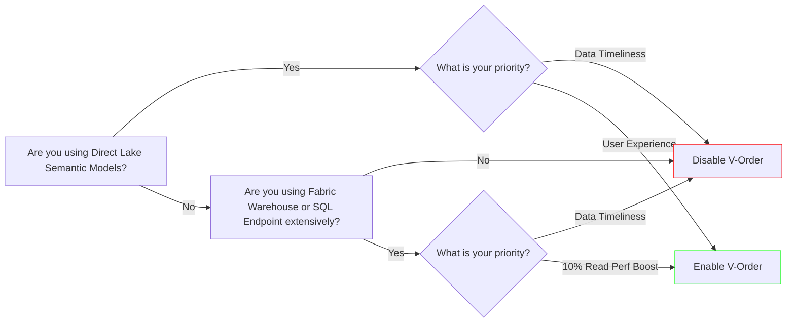

# Understanding V-Order Optimization in Microsoft Fabric

Fabric Spark Runtimes currently enable V-Order optimization by default as a Spark configuration. V-Order is a Parquet write optimization that seeks to logically organize data based on the same storage algorithm used in Power BI's VertiPaq engine.

The goal of this blog post is to explore V-Order optimization and the implications it has on various workloads to help inform the decision of whether it should always be enabled.

> While I'm a Microsoft employee, all thoughts and opinions on this topic are my own. Any performance metrics referenced should only be considered directionally accurate and confirmed via your own organizations data, query patterns, and workload architecture. Results are highly variable depending on various factors including data cardinality, row counts, file sizes, query patterns, and compute size / scale.

## What is V-Order?

While the [official documentation](https://learn.microsoft.com/en-us/fabric/data-engineering/delta-optimization-and-v-order?tabs=sparksql#what-is-v-order) provides great detail, the breadth of impact across workloads is deserving of a dedicated discussion.

To paraphrase the documentation: **V-Order is a write-time algorithm that applies special sorting, row group distribution, and dictionary encoding to Parquet files, prior to Snappy compression.**

Understanding when to apply V-Order is easier when we explore its origins and identify which workloads are optimized to benefit from it.

## The Lineage of V-Order

Before Microsoft Fabric introduced the concept of Direct Lake, data was either imported or direct queried (or both) into what was then called a *Dataset*. Possibly my favorite and most appropriate terminology name change by Microsoft, Datasets are now called **Semantic Models**.

When importing data into the Analysis Services database—the backend of Semantic Models—data is sorted and compressed into the VertiPaq columnar format. This format is similar to other columnar formats like Parquet but is highly optimized for the low-latency lookups and aggregations that Power BI is known for.

While these well-architected Import and Direct Query models were the pinnacle of business intelligence, they presented several challenges for data practitioners, data owners, and consumers:

- **Data Redundancy**: Data was stored multiple times—both in the data store (e.g., warehouse, lakehouse) and the Analysis Services model. This resulted in added latency for data timeliness and increased storage costs.
- **Data Refresh Lag and Management**: Changes in the source data did not automatically trigger the Semantic Model to refresh. This added latency and required developers to build automation to ensure reports were refreshed as soon as dimensional models were processed.
- **Data Silos**: With robust modeling and transformation capabilities in Power Query, Semantic Model developers could inadvertently create data silos within BI models. Key transformations, aggregations, and business logic were often not stored upstream in the data store, limiting their accessibility for other use cases like machine learning.

    _At a former company, an intern and I built our date dimension natively in Power BI as a cacluated table, while this was a super cool archievement given the complexity of the variable 4-4-5/4-5-4/5-4-4 calendar (thanks Finance!), this highly valuable table couldn't be used outside of Power BI._

To address these drawbacks, the idea of having Semantic Models natively surface data from Delta tables—**without needing to import the data**—was born. To ensure the data remained in a Power BI-optimized format, V-Order was created as a Parquet file optimization. This allowed VertiPaq sorting, encoding, and other optimizations to be included natively as Parquet data is written to Delta tables.

By pushing Power Query transformations and VertiPaq optimizations back to the lake, Direct Lake Semantic Models can directly query Power BI-optimized data in the lake and quickly hydrate Analysis Services models to cache data for faster results. A common misconception is that when a Direct Lake model caches data in the Analysis Services database, VertiPaq sorting and encoding are reapplied. This is not the case. If a Delta table does not have V-Order enabled, the data cached in the Analysis Services database will **not** have VertiPaq sorting and encoding applied.

This explains **why** V-Order is enabled by default in Fabric today. Power BI optimizations need to be pushed back to the lake to:
- Partially eliminate data redundancy.
- Eliminate the need for Semantic Model refreshes.
- Empower business logic to be consistently stored in the lake for multi-workload use cases.

## Which Workloads Benefit from V-Order?

To understand **when** to enable or disable V-Order, we need to identify which workloads are optimized to leverage the VertiPaq optimizations. Currently, the following workloads are designed at a low level to benefit from V-Order:

1. **Power BI Direct Lake Semantic Models**: Typically, you can see approximately a 40% improvement in cold-cache Direct Lake queries when V-Order is enabled.
2. **Fabric Warehouse**: Expect to see around a 10% improvement in read query performance but a 10-20% performance hit when writing data.
3. **SQL Endpoint (Fabric Warehouse)**: This is an extension of the Fabric Warehouse as it uses the same engine; anticipate a 10% read improvement here as well.

**Fabric Spark does NOT benefit from V-Order.** While it's rare, it's technically possible that V-Order can result in Parquet files smaller than non-V-Ordered files. However, in this case, Spark would only indirectly benefit by reading less data. It does **not** benefit from the VertiPaq-style sorting and encoding. V-Order impacts Fabric Spark in three ways:

- **Write Performance**: Enabling V-Order results in writes up to 33% slower.
- **Read Performance**: Enabling V-Order results in reads up to 50% slower.
- **File Sizes**: Enabling V-Order results in Parquet files up to 6% larger.

## When Should I Use V-Order?

In a traditional medallion architecture, there are clear zones where enabling V-Order does not make sense, and others where it's either a no-brainer or a gray area, depending on your workload and priorities. Everyone has different opinions on how to use zones in a medallion architecture; here is my preference:

| Zone              | Delta | Purpose                                                                                           | V-Order? |
|-------------------|-------|---------------------------------------------------------------------------------------------------|----------|
| Raw or Landing    | No    | Raw data in source format (can be stored in the Files section of the Bronze lakehouse)            | No       |
| Bronze            | Yes   | Reflect active records from the source with history maintained                                    | No       |
| Silver            | Yes   | Zone for data cleaning, pre-canonical modeling, or views containing business logic for Gold tables | No       |
| Gold              | Yes   | Clean dimensional model ready for ad-hoc queries and reporting                                    | Maybe    |

As noted above, if using Lakehouses for all zones in Fabric, there's arguably only one zone where V-Order strategically might make sense: **Gold**. I say "might make sense" because, as [Marco Russo at SQLBI blogged about](https://www.sqlbi.com/blog/marco/2024/04/06/direct-lake-vs-import-mode-in-power-bi/), Direct Lake is not a one-size-fits-all solution. There are many reasons why a company might continue using Import or Direct Query mode. If so, those models will only benefit from up to a 10% improvement in data serving performance in Power BI—much less so if Power BI tables are defined in Power Query as a simple `SELECT *` without joins and query predicates that benefit from V-Order.

### Decision Tree for Enabling V-Order

To help decide whether to enable V-Order, consider the following:


> Note: now that Fabric Warehouse supports disabling V-Order at the Warehouse level, you might consider disabling V-Order for staging tables and having a separate Warehouse with V-Order enabled for your serving layer.

What about non-Lakehouse-centric patterns? For use cases where the SQL Endpoint is heavily used or data is loaded from your Bronze Lakehouse into a Silver/Gold Warehouse, the decision becomes one of prioritizing data production versus data consumption. If you have thousands of ad-hoc queries run against your Fabric Warehouse, a 10% ad-hoc query performance improvement via V-Ordered tables could be entirely worth the performance hit of up to 33% slower writes in Fabric Spark. However, you may prefer to prioritize making data available for querying in your Silver/Gold Warehouse as fast as possible, accepting a small performance hit for your data consumers in exchange for data being available sooner.

## What About Optimized Write?
It's worth mentioning Optimized Write here since it is enabled by default for the same reason that V-Order is—it helps improve performance of select downstream workloads. I blogged about [Optimized Write](https://milescole.dev/data-engineering/2024/08/16/A-Deep-Dive-into-Optimized-Write-in-Microsoft-Fabric.html) back in August; if you haven't read the post, it's worth a read. Optimized Write can be a godsend but can also plague you with unnecessary slower writes. Knowing what it does and when to use it is critical.

Optimized Write is important for both Power BI Direct Lake and Fabric Warehouse / SQL Endpoint performance, as both data readers prefer larger Parquet files than Spark does. The default Bin Size setting of Optimized Write generates the optimal file size to improve performance of both of these workloads but can have a negative impact on Spark unless you are partitioning your Delta tables.

My general guidance here is to evaluate Optimized Write just like you'd evaluate V-Order: learn what it is, form a hypothesis, and test on your own data.

# How to Enable / Disable V-Order
V-Order is a Spark session configuration that determines whether a table written to by the Spark session is V-Ordered by default.

This can either be set as a Spark configuration in your environment or set inline as part of your Notebook or Spark Job Definition:
```python
spark.conf.set("spark.sql.parquet.vorder.enabled", "<true/false>")
```

If disabled at the session level, it can be selectively enabled as a table writer option:
```python
df.write.option("parquet.vorder.enabled ","true").saveAsTable("table1")
```
Or via SparkSQL:
```sql
CREATE TABLE table1 (c1 INT) 
    TBLPROPERTIES("delta.parquet.vorder.enabled" = "true");
```

# Closing Thoughts
When considering the impact of V-Order across workloads in Fabric, it's clear that it's worth developing a strategy for your implementation. Disabling V-Order for Delta tables without Direct Lake Semantic Model usage or heavy Warehouse / SQL Endpoint queries could provide a significant load and query performance boost in Spark with minimal effort. Strategically leaving it enabled for other zones, like _Gold_, will provide a significant user experience improvement for Direct Lake models and can help improve read performance of ad-hoc queries in the SQL Endpoint.

Would I enable V-Order for _all_ Direct Lake Semantic Models? It depends. Would your report users prefer having data available that is N minutes closer to real-time, or are their timeliness SLOs (Service-Level Objectives) already met, making the decision to improve the time to render Power BI visuals a no-brainer? Either way, communication is key. Have the conversation without getting overly technical:

_"I can have the data refreshed earlier, but visuals will be slower, OR I can have the data refreshed approximately N minutes later and have the visuals be more responsive."_