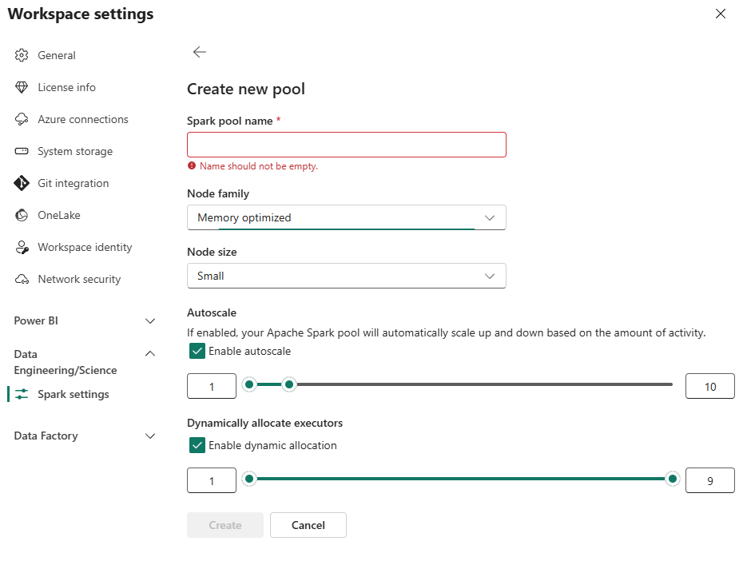

I've blogged on some relatively advanced topics as of late, but let's get back to the basics on this one: what is a Spark Pool in Fabric and how does it compare to Clusters and other related features in Databricks?

Every software vendor uses its own terminology and when terms overlap but don't mean the same thing, it sure can be confusing. Coming from the Databricks side of things, my assumption of what a Spark Pool was turned out to be completely wrong. 

# Fabric Spark Pool <> Databricks Pool
 I assumed that Fabric Spark Pools were nothing more than Pools in Databricks, reasonable assumption, right? Well, turns out I was wrong and this is an extremely important deliniation to understand as you certainly don't want to design your architecture assuming that Fabric Spark Pools are a bucket of VMs to consume from.

## Databricks Pools
Databricks Pools, formerly known as Instance Pools, are a [managed cache of VMs kept warm to decrease the latency of provisioning clusters](https://learn.microsoft.com/en-us/azure/databricks/compute/pool-index). A Pool simply serves the purpose of starting clusters faster and allowing the repurpose of the same VM from cluster to cluster.

## Fabric Spark Pools
Fabric Spark Pools on the other hand are functionally a compute size and scale template. This is conceptually very different from both Pools and Clusters in Databricks.

The following can be configured:
1. **Spark pool name** (of course)
1. **Node family**: right now the only option is memory optimized, in the future I expect that there will be other options such as compute optimized.
1. **Node size**: T-shirt size of node from Small, Medium, Largel, XL, and XXL.
1. **Autoscale**: Flag to determine whether the cluster will scale executors up and down dependent on compute needs.
1. **Node count**: Count of nodes (w/ min/max if autoscale is enabled). A few important points:
    - The count of nodes is inclusive of the Driver. If you want to run a job on a cluster with 4 workers (nodes) you need to set the node count to 5 (4 workers + 1 driver).
    - Setting the node count to 1 makes it a single node cluster where 1 core on the node acts as the driver, and the rest of the cores act as individual workers.
1. **Dynamic Allocation**: allows the number of executors allocated to a Spark application to be dynamically adjusted based on the workload. When enabled, Spark can automatically add or remove executors during the runtime of a Spark job based on the stage of the job and the resource requirements at any given time.

You'll notice that a Spark Pool does not allow you to set the Runtime version, libraries, spark configs, etc. This is where Environments come into play. 

To recap:
Spark Pool = Compute size and scale
Environment = Cluster configuration

Via creating a Spark Pool and an Environment, you get all the same control over how clusters are created in Databricks. Coming from Databricks land, it was not intuative at first, however now that I fully understand the deliniation, I prefer the separation that Fabric provides: as a workspace admin, I can define a couple compute sizes appropriate for my users and then allow the users to apply various different environment configurations on top of the Spark Pools, i.e. for the use case of having libraries installed or settings set as part of the cluster startup.

# When is compute charged/consumed?
This is another area where things differ between Fabric and Databricks.

In Fabric, if you are using a workspace that is not part of a managed vNet, you get access to starter pools that allow you to start executing code in around 5 to 15 seconds. This is an absolute game changer to improve developer productivity. Microsoft is able to acomplish this super low latency for cluster start up times because nodes are kept warm with the Fabric Runtime already installed and Spark as an application already running.

If this alone isn't just the bees knees, consider that these start pools don't consume capacity units when not in use, CUs are only consumed once your Spark Session starts. That's right, even when the start pool nodes are being personalized with custom libraries, etc., CUs are not consumed/billed. The documentation has a great illustration for this:

For custom pools, it's the same, you are only billed once your Spark Session starts running:

With Databricks on the other hand, you pay for the VM as soon as the VM is provisioned (entirely reasonable) and then once the Spark Context starts (typically 40 + seconds later) you also pay Databricks licensing fees, DBUs. For that instance pool you have running to decrease cluster start up times, you are paying for the VMs every second they sit idle or allocated in the pool (again, entirely reasonable).